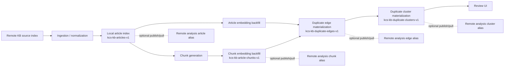

# Architecture Overview

## Purpose

`kcs-control-plane` is a local duplicate-detection and cluster-review system for Elastic KB articles.

The architecture is built around one idea:

- keep the expensive duplicate-analysis steps persisted and resumable
- let the UI consume those persisted artifacts directly

## High-Level Flow

## Main Components

### Backend

The backend is a FastAPI application in [backend/app](../backend/app).

Main areas:

- ingestion:
  - [backend/app/ingestion/kb.py](../backend/app/ingestion/kb.py)
- duplicate embeddings:
  - [backend/app/backfill/duplicate_embeddings.py](../backend/app/backfill/duplicate_embeddings.py)
- chunking:
  - [backend/app/dedup/chunking.py](../backend/app/dedup/chunking.py)
- similarity search:
  - [backend/app/similarity/service.py](../backend/app/similarity/service.py)
- cluster materialization:
  - [backend/app/clustering/service.py](../backend/app/clustering/service.py)
- admin pipeline orchestration:
  - [backend/app/admin_jobs.py](../backend/app/admin_jobs.py)

### Frontend

The frontend is a React + Vite application in [frontend/src](../frontend/src).

Main pages:

- `Lookup`
- `Review Queue`
- `Cluster Explorer`
- `Cluster Detail`
- `Admin`

The modern data path is API-backed for:

- cluster list
- cluster detail
- lookup similarity search
- article-to-cluster membership
- cluster review-state updates

Some older mock/demo compare flows still exist as fallback UI code.

## Remote Cluster Roles

The architecture now distinguishes two remote roles:

- `remote source cluster`
  - read-only source KB content
- `remote analysis cluster`
  - published duplicate-analysis snapshots

They may be the same physical Elasticsearch deployment, but they must not share the same index or alias names.

The source KB index stays read-only.
Published analysis uses separate aliases such as:

- `kb-analysis-articles`
- `kb-analysis-article-chunks`
- `kb-analysis-duplicate-edges`
- `kb-analysis-duplicate-clusters`

The Admin UI now surfaces:

- alias names
- alias backing indices
- latest published remote run metadata
- latest local sync metadata
- stale-local warnings when the workspace is behind the published remote snapshot

## Data Model

### Article index

Index:

- `kcs-kb-articles-v1`

Important fields:

- normalized KB content:
  - `title`
  - `summary`
  - `body_markdown`
  - `symptoms`
- duplicate-comparison text:
  - `compare_text`
  - `compare_text_hash`
- article embeddings:
  - `duplicate_title_embedding`
  - `duplicate_summary_embedding`
  - `duplicate_body_embedding`
  - `duplicate_comparison_embedding`

### Chunk index

Index:

- `kcs-kb-article-chunks-v1`

Chunk types currently include:

- `title`
- `summary`
- `symptoms`
- `body_section`

Each chunk stores its own duplicate-comparison embedding.

### Edge index

Index:

- `kcs-kb-duplicate-edges-v1`

Stores accepted duplicate/near-duplicate pair decisions, including:

- pair label
- total score
- per-signal scores
- reasons
- chunk evidence

### Cluster index

Index:

- `kcs-kb-duplicate-clusters-v1`

Stores persisted duplicate families, including:

- member article IDs
- supporting edge IDs
- representative article
- review state
- thresholds used for materialization
- membership-level reasons and metadata

## Search Architecture

Lookup search is hybrid.

For article-ID queries:

- the backend loads the existing normalized article
- it reuses persisted embeddings and chunk data

For ad hoc free-text queries:

- the backend creates a temporary normalized query document
- it builds duplicate-comparison text
- it generates query embeddings on the fly
- it generates temporary query chunks and chunk embeddings

Retrieval signals:

- lexical candidate retrieval
- vector candidate retrieval from article embeddings
- chunk-seeded retrieval from chunk embeddings
- reranker support

Final score blends:

- reciprocal rank fusion
- article embedding similarity
- best chunk similarity
- title similarity
- summary similarity
- metadata agreement
- reranker score

## Full Refresh Pipeline

The full refresh pipeline is orchestrated through the admin job manager.

Steps:

1. ingest remote KB documents
2. backfill article embeddings
3. rebuild/embed chunks
4. materialize duplicate edges and clusters

## Pull And Publish Workflows

### Pull published analysis into local

Admin workflow:

- `POST /admin/workflows/pull-remote-analysis`

Behavior:

- read the remote published analysis aliases
- overwrite the local working indices with that snapshot
- preserve embeddings, edges, and clusters as stored remotely

This is intended for new users or fresh local environments.

### Publish local analysis to remote

Admin workflow:

- `POST /admin/workflows/publish-remote-analysis`

Behavior:

1. create versioned remote staging indices
2. copy local working indices into them
3. validate document counts
4. atomically switch the remote analysis aliases

This avoids exposing half-finished local materialization runs to other users.

## Resilience And Resume Strategy

The current architecture is designed to avoid losing expensive work.

### Steps 1-3

These steps are persisted and reused when possible:

- unchanged articles keep their enrichment
- unchanged chunks are reused
- embeddings are only recomputed when source comparison content changes

### Step 4

Step 4 originally held too much in memory and only wrote at the very end. That has been reworked.

Current behavior:

- accepted edges are checkpoint-written to `kcs-kb-duplicate-edges-v1`
- step 4 can resume from persisted edges
- connected components are processed incrementally
- cluster documents are checkpoint-written during graph resolution
- small components are processed first
- oversized components use stronger split rules before final persistence

This means:

- interruptions do not force a complete rescan from scratch
- cluster output starts appearing before the final component finishes

## Review-State Persistence

Cluster review-state is now persisted via:

- `PATCH /kb/clusters/{cluster_id}`

Supported states:

- `pending_review`
- `approved_family`
- `rejected_family`
- `split_required`

These states affect review workflow only.

They do not:

- create a new KB article
- merge source articles
- write back to the remote source cluster

## Known Deliberate Boundaries

The architecture currently stops at review-state persistence.

Not yet part of the design:

- canonical article generation
- article merge authoring
- remote source content write-back
- review audit trail / notes
- user/permission model

Those pieces are intentionally deferred until duplicate quality and reviewer workflow are considered stable.
